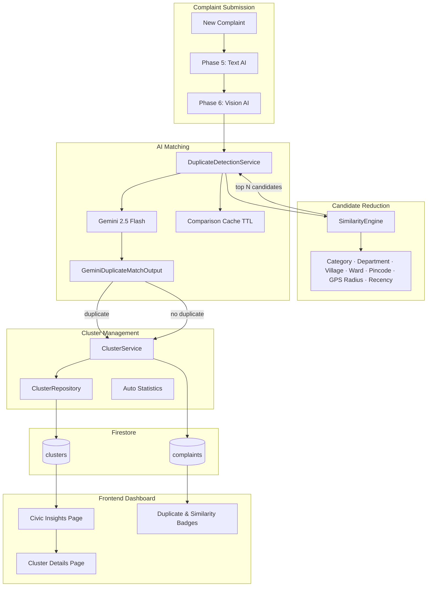

# CivicLens AI — Phase 7: Duplicate Detection & Clustering Architecture

## Overview

Phase 7 implements an AI-powered **Duplicate Detection & Complaint Clustering Engine** that runs automatically after Phase 5 (text AI) and Phase 6 (vision AI) complete on complaint submission.

---

## Architecture Diagram



---

## Cluster Management Flow

```
1. Complaint saved with AI + vision analysis complete
2. DuplicateDetectionService.process_if_needed()
   a. Skip if cluster_id already set
   b. SimilarityEngine.find_candidates() — heuristic pre-filter
   c. If no candidates → ClusterService.create_cluster_for_complaint()
   d. Else → Gemini batch match against top candidates (cached)
   e. If is_duplicate AND similarity_score >= threshold:
        - Assign to existing_cluster_id OR matched complaint's cluster
      Else:
        - Create new cluster
3. ClusterService updates:
   - complaint_count, average_severity, latest_complaint_date
   - representative_complaint_id, affected_area
   - priority_score (placeholder formula), hotspot_score
   - average_confidence, coordinates centroid
4. Complaint updated:
   - cluster_id, status=clustered
   - is_duplicate, duplicate_score, duplicate_reason
   - duplicate_confidence, matched_complaint_id, matched_cluster_id
```

---

## Gemini Matching Prompt

**Role:** Intelligent Civic Complaint Matching Engine  
**File:** `backend/app/services/clustering/matching_prompt_builder.py`  
**Version:** `CLUSTERING_PROMPT_VERSION=1.0.0`

Inputs:
- New complaint snapshot (title, description, AI analysis, image analysis, location)
- Pre-ranked candidate complaints with heuristic scores

Output: Strict JSON only (see schema below)

---

## JSON Schema

**Model:** `GeminiDuplicateMatchOutput`  
**File:** `backend/app/models/schemas/ai_duplicate_matching.py`

```json
{
  "is_duplicate": true,
  "similarity_score": 85,
  "matching_reason": "Same pothole location with matching keywords and GPS proximity",
  "existing_cluster_id": "cluster_abc123",
  "matched_complaint_id": "complaint_xyz789",
  "confidence": 0.91,
  "explanation": "Evidence-based explanation referencing specific fields"
}
```

| Field | Type | Notes |
|-------|------|-------|
| is_duplicate | boolean | Conservative — only true with strong evidence |
| similarity_score | int 0-100 | Overall duplicate likelihood |
| matching_reason | string | Short reason |
| existing_cluster_id | string \| null | Cluster to join if duplicate |
| matched_complaint_id | string \| null | Best matching candidate |
| confidence | float 0-1 | Model certainty |
| explanation | string | Detailed evidence |

---

## Firestore Cluster Structure

```json
{
  "id": "cluster_rural_roads",
  "title": "Pothole — Jagdishpur",
  "description": "AI summary of cluster theme",
  "theme": "pothole",
  "category": "roads",
  "status": "analyzing",
  "department": "Public Works Department",
  "village_name": "Jagdishpur",
  "village_names": ["Jagdishpur", "Bhadar"],
  "village_ids": ["village_jagdishpur"],
  "coordinates": { "latitude": 26.12, "longitude": 82.45 },
  "complaint_ids": ["complaint_1", "complaint_2"],
  "complaint_refs": ["complaints/complaint_1"],
  "complaint_count": 2,
  "representative_complaint_id": "complaint_1",
  "average_severity": "High",
  "latest_complaint_date": "2026-07-06T10:00:00Z",
  "average_confidence": 0.87,
  "affected_area": "Jagdishpur (near bus stand)",
  "priority_score": 0.72,
  "hotspot_score": 0.65,
  "constituency": "Amethi",
  "district": "Amethi",
  "state": "Uttar Pradesh",
  "metadata": { "created_at": "...", "updated_at": "..." }
}
```

### Complaint duplicate fields

```json
{
  "cluster_id": "cluster_rural_roads",
  "cluster_ref": "clusters/cluster_rural_roads",
  "status": "clustered",
  "is_duplicate": true,
  "duplicate_score": 85.0,
  "duplicate_reason": "Matching pothole with same landmark",
  "duplicate_confidence": 0.91,
  "matched_complaint_id": "complaint_road_jagdishpur",
  "matched_cluster_id": "cluster_rural_roads"
}
```

---

## End-to-End Request/Response Flow

### Automatic (on create)

```
POST /api/v1/complaints
  → ComplaintService.create()
  → ComplaintAIService.analyze_if_needed()
  → ImageVisionService.analyze_if_needed() [if image]
  → DuplicateDetectionService.process_if_needed()
  → Response includes cluster_id, duplicate fields
```

### Manual retry

```
POST /api/v1/complaints/{id}/cluster?force=false
POST /api/v1/clusters/process/{complaint_id}?force=false
```

### Dashboard APIs

```
GET /api/v1/clusters/dashboard     → KPI summary + top hotspots
GET /api/v1/clusters?page=1        → Paginated cluster cards
GET /api/v1/clusters/{id}          → Cluster detail + related complaints
```

---

## Optimization

| Strategy | Implementation |
|----------|----------------|
| Never compare all complaints | Firestore pre-filter by category, village/district, recency |
| Heuristic gate | `CLUSTERING_MIN_HEURISTIC_SCORE` before Gemini |
| Cap candidates | `CLUSTERING_MAX_CANDIDATES=8` |
| Cache Gemini results | In-memory TTL cache keyed by complaint + candidate set |
| Skip clustered | Skip if `cluster_id` already set (unless `force=true`) |
| Single Gemini call | Batch all candidates in one prompt |

---

## Configuration

```env
CLUSTERING_ENABLED=true
CLUSTERING_PROMPT_VERSION=1.0.0
CLUSTERING_MAX_CANDIDATES=8
CLUSTERING_CANDIDATE_POOL_SIZE=100
CLUSTERING_RADIUS_KM=2.0
CLUSTERING_RECENT_DAYS=90
CLUSTERING_MIN_HEURISTIC_SCORE=0.2
CLUSTERING_DUPLICATE_THRESHOLD=70
CLUSTERING_COMPARISON_CACHE_TTL=3600
```

---

## Phase 8 Integration (Priority Engine)

No refactoring required. Phase 8 can consume:

| Source | Fields for priority scoring |
|--------|----------------------------|
| Complaint `ai_analysis` | urgency, severity, priority_level, urgency_score |
| Complaint `image_analysis` | requires_urgent_attention, road_safety_risk |
| Cluster | priority_score, hotspot_score, average_severity, complaint_count |
| Duplicate metadata | duplicate_score, is_duplicate |

A future `PriorityEngineService` reads these as **read-only inputs** and writes to a separate `priority_score` / `priority_tier` field — without modifying clustering or AI pipelines.

---

## Module Map

| Module | Path |
|--------|------|
| Similarity Engine | `services/clustering/similarity_engine.py` |
| Duplicate Detection | `services/clustering/duplicate_detection_service.py` |
| Cluster Service | `services/clustering/cluster_service.py` |
| Matching Prompt | `services/clustering/matching_prompt_builder.py` |
| Response Parser | `services/clustering/matching_response_parser.py` |
| Portal Service | `services/cluster_portal_service.py` |
| API | `api/v1/endpoints/clusters.py` |
| DI | `api/clustering_deps.py` |
| Dashboard UI | `pages/CivicInsightsPage.tsx` |
| Cluster Detail UI | `pages/ClusterDetailsPage.tsx` |
