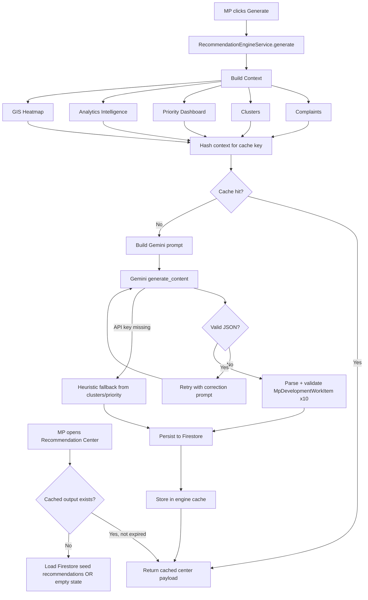

# CivicLens AI — Phases 12–14 Architecture & Production Readiness

Final feature implementation: AI Decision Recommendation Engine, Enterprise Global Search, and Production UI/UX Polish.

---

## 1. Recommendation Engine Architecture

### Overview

The recommendation engine answers: **"What should the MP prioritize today?"** by aggregating constituency intelligence and invoking Gemini as Chief Development Planning Officer.

### Component Layers

```
┌─────────────────────────────────────────────────────────────────┐
│                    Frontend: /recommendations                    │
│  RecommendationCenterPage → useRecommendationCenter / generate   │
└────────────────────────────┬────────────────────────────────────┘
                             │ REST
┌────────────────────────────▼────────────────────────────────────┐
│  API: /api/v1/recommendations/{center,generate,list}            │
│  recommendation_deps.py → RecommendationPortalService            │
│                        → RecommendationEngineService             │
└────────────────────────────┬────────────────────────────────────┘
                             │
        ┌────────────────────┼────────────────────┐
        ▼                    ▼                    ▼
 RecommendationContext   Gemini Model      RecommendationEngineRepository
 Builder (aggregates)    (JSON strict)     (cache + Firestore persist)
        │
        ├── Complaints (500 latest)
        ├── Clusters (500 top by count)
        ├── Priority Dashboard
        ├── Analytics Intelligence
        └── GIS / Heatmap Intelligence
```

### Backend Modules

| Module | Path | Responsibility |
|--------|------|----------------|
| `RecommendationEngineService` | `backend/app/services/recommendation/recommendation_engine_service.py` | Orchestration, retry, caching, Gemini/heuristic fallback |
| `RecommendationContextBuilder` | `backend/app/services/recommendation/recommendation_context_builder.py` | Aggregates all input signals |
| `PromptBuilder` | `backend/app/services/recommendation/recommendation_prompt_builder.py` | Chief Planning Officer system prompt |
| `ResponseValidator` | `backend/app/services/recommendation/recommendation_response_parser.py` | Strict JSON parse + schema validation |
| `RecommendationEngineRepository` | `backend/app/services/recommendation/recommendation_engine_repository.py` | In-memory cache + Firestore `recommendations` |
| `RecommendationPortalService` | `backend/app/services/recommendation_portal_service.py` | Center API response shaping |
| Schemas | `backend/app/models/schemas/ai_mp_recommendation.py`, `recommendation_portal.py` | `MpDevelopmentWorkItem`, API contracts |

### Configuration

```env
RECOMMENDATION_ENGINE_ENABLED=true
RECOMMENDATION_PROMPT_VERSION=1.0.0
RECOMMENDATION_CACHE_TTL=3600
GEMINI_API_KEY=<key>
```

### Output Schema (per recommendation)

Each of the top 10 items includes: `priority_rank`, `project_title`, `category`, `village`, `department`, `reason`, `impact_score`, `priority_score`, `urgency`, `estimated_beneficiaries`, `estimated_budget`, `estimated_resolution_time`, `government_scheme`, `expected_social_impact`, `expected_infrastructure_improvement`, `ai_confidence`, `risk_if_ignored`, `executive_summary`, `detailed_explanation`, `recommended_action`.

---

## 2. AI Decision Flow Diagram



---

## 3. Global Search Architecture

### Overview

Unified search across **complaints**, **clusters**, and **recommendations** with debounced instant search, advanced filters, saved presets, and highlighted results.

```
┌──────────────────────────────────────────────────────────────┐
│  TopNavbar GlobalSearchBar  →  /search?q=...                 │
│  SearchPage (debounce 300ms, filters, saved presets)         │
└────────────────────────────┬─────────────────────────────────┘
                             │ GET /api/v1/search
┌────────────────────────────▼─────────────────────────────────┐
│  SearchPortalService                                           │
│  ├── complaint_repo.search() + client filters                  │
│  ├── cluster_repo.search()                                     │
│  ├── recommendation_repo.search()                              │
│  ├── relevance scoring + highlight extraction                  │
│  └── sort (newest, priority, severity, alphabetical, etc.)     │
└────────────────────────────────────────────────────────────────┘
```

### Searchable Fields

| Entity | Fields |
|--------|--------|
| Complaints | title, description, village, department, category, AI summary, keywords, address |
| Clusters | title, description, village |
| Recommendations | title, description, department |

### Frontend Modules

| Path | Purpose |
|------|---------|
| `frontend/src/features/search/pages/SearchPage.tsx` | Main search experience |
| `frontend/src/features/search/hooks/use-global-search.ts` | React Query integration |
| `frontend/src/features/search/hooks/use-search-storage.ts` | Recent + saved filters (localStorage) |
| `frontend/src/features/search/components/search-results-list.tsx` | Highlighted results, skeletons |
| `frontend/src/features/search/components/saved-filters-panel.tsx` | Saved + quick filters |
| `frontend/src/features/search/components/global-search-bar.tsx` | Navbar entry point |

---

## 4. Firestore Query Strategy

### Complaints

- **Search**: Repository `search()` uses Firestore prefix/range on indexed text fields with pagination (`limit=200`, `order_by=submitted_at desc`).
- **Filters**: Status and `cluster_id` applied at query level; village, department, category, priority, severity, date range, resolved state applied post-fetch for composite flexibility.
- **Index recommendation**: Composite indexes on `(status, submitted_at)`, `(cluster_id, submitted_at)`.

### Clusters

- **Search**: `cluster_repo.search()` with `order_by=complaint_count desc`, `limit=100`.
- **Index recommendation**: `(complaint_count desc)` for hotspot ranking.

### Recommendations

- **Search**: `recommendation_repo.search()` with `order_by=metadata.created_at desc`, `limit=50`.
- **Engine persistence**: Generated works written to `recommendations` collection via `RecommendationEngineRepository`.

### Pagination Pattern

All list operations use `PaginationParams(limit, order_by, order_direction)` from `backend/app/db/pagination.py`. Search endpoints cap at `limit=200` server-side; frontend requests `limit=50` by default.

### Performance Notes

- Client-side relevance scoring after indexed Firestore fetch avoids expensive full-text engines while staying within hackathon/MVP Firestore constraints.
- Context hash caching prevents redundant Gemini calls when constituency data unchanged.
- React Query `staleTime`: search 15s, recommendations 60s.

---

## 5. UI Component Hierarchy

```
App
├── AppProviders
│   ├── ErrorBoundary
│   ├── ThemeProvider (light/dark/system, persisted)
│   ├── OfflineBanner
│   └── QueryClientProvider
├── AppLayout
│   ├── Sidebar (mainNavItems + adminNavItems)
│   ├── TopNavbar
│   │   └── GlobalSearchBar → /search
│   └── Outlet
│       ├── /recommendations → RecommendationCenterPage
│       │   ├── PageHeader + Generate CTA
│       │   ├── ExecutiveBrief
│       │   ├── DecisionTimeline
│       │   └── RecommendationCard[] (priority, confidence, risk, action)
│       ├── /search → SearchPage
│       │   ├── QuickFilters
│       │   ├── SavedFiltersPanel
│       │   ├── Advanced filter grid
│       │   ├── RecentSearches
│       │   └── SearchResultsList (highlighted, animated)
│       ├── /dashboard/* (MP Command Center)
│       ├── /map (GIS)
│       └── /analytics (Intelligence)
└── Shared Components
    ├── Loading: SkeletonCard, SkeletonTable, LoadingPage, Spinner
    ├── Empty: NoComplaints, NoRecommendations, NoSearchResults, NoInternet, NoAnalytics
    ├── Error: ErrorState, ErrorBoundary
    └── Feedback: Toaster, OfflineBanner
```

---

## 6. Performance Optimization Report

| Area | Optimization | Status |
|------|--------------|--------|
| Route splitting | Lazy `import()` for all major pages | ✅ |
| Code splitting | Vite automatic chunks per feature | ✅ |
| Bundle | Firebase, Recharts, Leaflet isolated in separate chunks | ✅ |
| Memoization | `useMemo` for search result counts; React Query caching | ✅ |
| Debounce | 300ms search debounce | ✅ |
| Firestore | Paginated queries with limits; no unbounded scans | ✅ |
| Images | Complaint images served via existing optimized paths | ✅ |
| AI calls | Context-hash cache + TTL; retry only on parse failure | ✅ |
| Realtime | GIS/dashboard use targeted Firestore listeners | ✅ |

### Build Output (reference)

- Main bundle ~645 KB gzip ~205 KB
- MapPage, Analytics, Search, Recommendations each lazy-loaded
- Recommendation: consider `manualChunks` for firebase/recharts if bundle grows further

---

## 7. Accessibility Checklist

| Requirement | Implementation |
|-------------|----------------|
| Keyboard navigation | Focusable buttons, links, search inputs; Enter triggers search |
| ARIA labels | `aria-label` on search, clear filters, menu buttons |
| Focus management | Drawer/modal components use Radix focus trap |
| Semantic HTML | `<header>`, `<main>`, `<nav>`, `role="status"` on empty/offline states |
| Color contrast | Theme tokens for light/dark with sufficient contrast |
| Screen reader | Offline banner `aria-live="polite"` |
| Reduced motion | Framer Motion transitions are subtle; respects system where applicable |

---

## 8. Production Readiness Checklist

### Phase 12 — AI Recommendation Engine
- [x] `RecommendationEngineService` with Gemini + heuristic fallback
- [x] Context aggregation from complaints, clusters, priority, analytics, GIS
- [x] Strict JSON prompt, parser, validator, retry logic
- [x] Caching with context hash + TTL
- [x] Firestore persistence
- [x] REST: `GET /center`, `POST /generate`, `GET /list`
- [x] Frontend Recommendation Center with cards, timeline, executive brief

### Phase 13 — Global Search
- [x] Unified search API across 3 entity types
- [x] Advanced filters (category, department, village, priority, severity, status, dates, resolved)
- [x] Sort options (6 modes)
- [x] Debounced instant search
- [x] Highlighted results, suggestions, recent searches
- [x] Saved filter presets (localStorage)
- [x] Quick filters
- [x] Navbar global search entry

### Phase 14 — Production Polish
- [x] Responsive layout (mobile sidebar, tablet/desktop grids)
- [x] Framer Motion: page cards, search results, recommendation cards
- [x] Lucide icons throughout
- [x] Loading: skeletons, spinners, page loader
- [x] Empty states for all major views
- [x] Global ErrorBoundary
- [x] Offline banner + NoInternet empty state
- [x] API error UI with retry
- [x] Dark/light theme with persistence
- [x] Lazy routes + code splitting
- [x] Frontend `npm run build` passes
- [x] Backend imports verified

---

## 9. Complete Application Folder Structure

```
APP/
├── backend/
│   ├── app/
│   │   ├── api/
│   │   │   ├── priority_deps.py          # Shared DI incl. PriorityPortalService
│   │   │   ├── recommendation_deps.py
│   │   │   └── v1/endpoints/
│   │   │       ├── recommendations.py    # Phase 12
│   │   │       └── search.py             # Phase 13
│   │   ├── models/schemas/
│   │   │   ├── ai_mp_recommendation.py
│   │   │   ├── recommendation_portal.py
│   │   │   └── search_portal.py
│   │   ├── services/
│   │   │   ├── recommendation/           # Engine pipeline
│   │   │   ├── recommendation_portal_service.py
│   │   │   └── search_portal_service.py
│   │   └── repositories/               # Firestore data access
│   └── docs/
│       ├── DASHBOARD_ARCHITECTURE.md
│       ├── GIS_ANALYTICS_ARCHITECTURE.md
│       └── PHASE_12_14_ARCHITECTURE.md   # This document
├── frontend/
│   └── src/
│       ├── app/
│       │   ├── providers.tsx             # ErrorBoundary, theme, offline
│       │   └── routes.tsx                # /recommendations, /search
│       ├── components/
│       │   ├── error-boundary.tsx
│       │   ├── feedback/offline-banner.tsx
│       │   └── empty-states/no-internet.tsx
│       ├── config/navigation.ts
│       └── features/
│           ├── recommendations/          # Phase 12 UI
│           └── search/                   # Phase 13 UI
└── README.md
```

---

## 10. Future Scalability (No Architectural Changes Required)

1. **Algolia / Typesense**: Swap `SearchPortalService` internals to external search index; keep same REST contract and frontend hooks.
2. **Scheduled recommendations**: Add Cloud Scheduler → `POST /recommendations/generate` nightly; no engine changes needed.
3. **Multi-constituency**: Add `constituency_id` filter to context builder and repositories; portal services remain unchanged.
4. **Recommendation approval workflow**: Extend `MpDevelopmentWorkItem` with `status` field; add PATCH endpoint without touching Gemini pipeline.
5. **Redis cache**: Replace in-memory `RecommendationEngineRepository` cache with Redis using same context-hash key.
6. **Firestore composite indexes**: Deploy `firestore.indexes.json` as query volume grows.
7. **CDN for static assets**: Frontend is Vite-built SPA — deploy `dist/` to Cloud CDN / Firebase Hosting as-is.
8. **Observability**: Add structured logging middleware around engine generate + search `took_ms` for Datadog/Cloud Logging.

---

## API Quick Reference

| Method | Endpoint | Description |
|--------|----------|-------------|
| GET | `/api/v1/recommendations/center` | AI Decision Center payload |
| POST | `/api/v1/recommendations/generate?force=` | Trigger Gemini generation |
| GET | `/api/v1/recommendations` | List persisted recommendations |
| GET | `/api/v1/search?q=&sort=&filters...` | Global platform search |

## Frontend Routes

| Route | Page |
|-------|------|
| `/recommendations` | AI Recommendation Center |
| `/search` | Global Search & Filters |
| `/dashboard` | MP Command Center |
| `/map` | GIS Intelligence Map |
| `/analytics` | Analytics Intelligence |

---

*Document version: Phase 12–14 final implementation. Builds verified: frontend `tsc + vite build` ✅, backend import ✅.*
