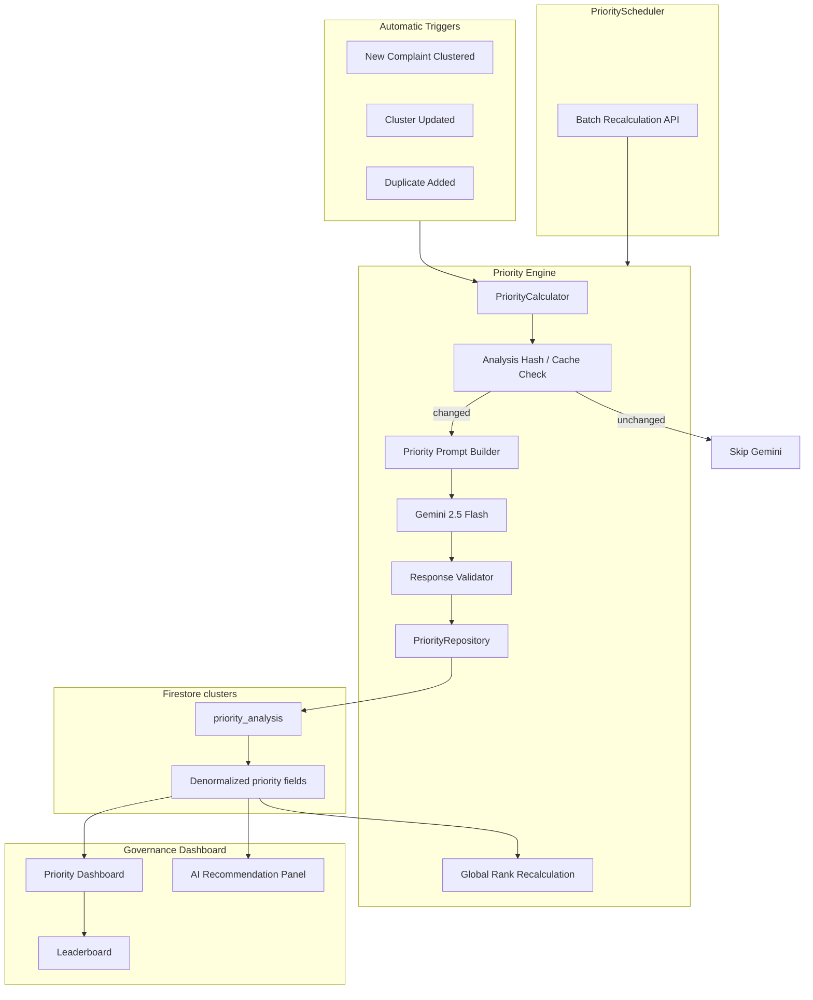
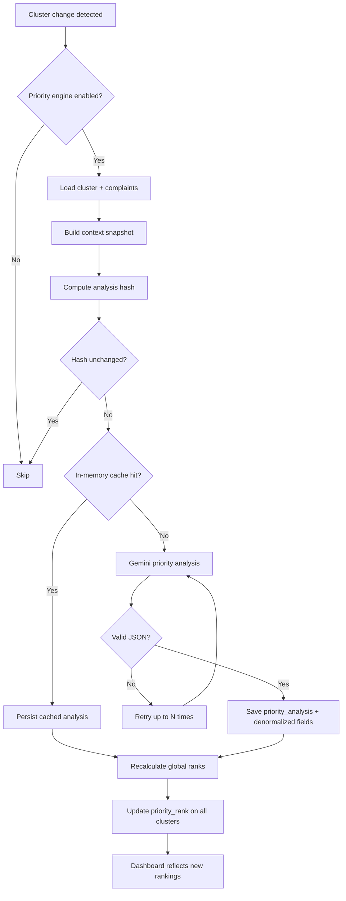

# CivicLens AI — Phase 8: Priority Engine Architecture

## Overview

Phase 8 implements the **AI Priority Engine** — the core government decision intelligence layer that ranks complaint clusters using Gemini 2.5 Flash with explainable, evidence-based reasoning.

---

## Architecture Diagram



---

## Decision Flow Diagram



---

## Firestore `priority_analysis` Structure

```json
{
  "priority_analysis": {
    "priority_score": 82,
    "impact_score": 78,
    "urgency_level": "High",
    "risk_level": "High",
    "affected_population_estimate": "200-500 residents",
    "public_safety_risk": "Moderate-to-high risk for two-wheelers",
    "infrastructure_criticality": "Primary village access road",
    "environmental_impact": "Localized surface damage",
    "economic_impact": "Commute and trade disruption",
    "suggested_department": "Public Works Department",
    "recommended_action": "Immediate patching and safety signage",
    "estimated_resolution_time": "7-21 days temporary; 4-8 weeks permanent",
    "estimated_budget_range": "INR 1.5-4 Lakhs",
    "priority_rank": 1,
    "reasoning": "Evidence-based explanation...",
    "confidence_score": 0.86,
    "contributing_factors": ["cluster size", "high severity", "road safety"],
    "expected_impact": "Reduced accident risk",
    "estimated_beneficiaries": "200-500 daily road users",
    "why_priority_ranked_high": "Repeated high-severity road complaints with urgent image evidence",
    "analysis_hash": "a1b2c3...",
    "processed_at": "2026-07-06T12:00:00Z",
    "model_version": "gemini-2.5-flash",
    "prompt_version": "1.0.0"
  },
  "priority_score": 0.82,
  "impact_score": 78,
  "urgency_level": "High",
  "priority_rank": 1,
  "recommended_department": "Public Works Department",
  "recommended_action": "Immediate patching and safety signage",
  "estimated_budget": "INR 1.5-4 Lakhs",
  "estimated_resolution_time": "7-21 days temporary; 4-8 weeks permanent",
  "affected_population": "200-500 residents",
  "priority_reasoning": "Evidence-based explanation...",
  "priority_confidence": 0.86,
  "priority_updated_at": "2026-07-06T12:00:00Z",
  "priority_analysis_hash": "a1b2c3..."
}
```

---

## Gemini Prompt Template

**Role:** Senior Government Planning Officer prioritizing constituency development for MPs  
**File:** `backend/app/services/priority/priority_prompt_builder.py`  
**Version:** `PRIORITY_PROMPT_VERSION=1.0.0`

Key instructions:
- Reason like a District Collector / Planning Officer
- Never hallucinate — only use cluster and complaint evidence
- Explain why priority is high or low
- Return strict JSON only
- Conservative population and budget estimates

---

## JSON Schema

**Model:** `GeminiClusterPriorityOutput`  
**File:** `backend/app/models/schemas/ai_cluster_priority.py`

Required fields: `priority_score`, `impact_score`, `urgency_level`, `risk_level`, `affected_population_estimate`, `public_safety_risk`, `infrastructure_criticality`, `environmental_impact`, `economic_impact`, `suggested_department`, `recommended_action`, `estimated_resolution_time`, `estimated_budget_range`, `reasoning`, `confidence_score`, `contributing_factors`, `expected_impact`, `estimated_beneficiaries`, `why_priority_ranked_high`

---

## End-to-End Request/Response Flow

### Automatic (after clustering)

```
Complaint submitted → AI analysis → Vision analysis → Clustering
  → ClusterService.create/assign
  → PriorityEngineService.analyze_if_needed_safe(cluster_id)
  → Global rank recalculation
```

### Manual APIs

```
GET  /api/v1/priority/dashboard
POST /api/v1/priority/analyze/{cluster_id}?force=false
POST /api/v1/priority/rerank?force=false
```

### Dashboard response highlights

- Top 10 priority issues
- Priority leaderboard (ranked)
- Critical issues
- Highest impact areas
- Department-wise and village-wise breakdowns
- Explainable AI recommendation panels

---

## Optimization

| Strategy | Implementation |
|----------|----------------|
| Skip unchanged clusters | SHA-256 analysis hash over complaint/cluster state |
| In-memory cache | TTL cache keyed by cluster + hash |
| No redundant Gemini | `analyze_if_needed` only on data change |
| Batch scheduler | `PriorityScheduler.run_full_recalculation()` for cron-ready batch |
| Safe pipeline hooks | `analyze_if_needed_safe` never fails complaint flow |

---

## Configuration

```env
PRIORITY_ENGINE_ENABLED=true
PRIORITY_PROMPT_VERSION=1.0.0
PRIORITY_CACHE_TTL=3600
PRIORITY_RANKING_LIMIT=500
```

---

## Phase 9+ Integration (No Refactoring Required)

### Analytics Dashboard
Reads denormalized `priority_score`, `impact_score`, `priority_rank`, `urgency_level` for constituency KPIs and trend charts.

### Heatmaps
Uses `coordinates` + `priority_score` / `hotspot_score` from clusters for geo-visual priority heatmaps.

### AI Recommendation Engine
Consumes `priority_analysis.recommended_action`, `estimated_budget_range`, `estimated_resolution_time`, and `suggested_department` as structured inputs for actionable government recommendations.

**Design principle:** Priority engine writes to `priority_analysis` and denormalized cluster fields. Downstream modules read these as inputs without modifying the priority pipeline.

---

## Module Map

| Module | Path |
|--------|------|
| Priority Calculator | `services/priority/priority_calculator.py` |
| Priority Engine | `services/priority/priority_engine_service.py` |
| Priority Repository | `services/priority/priority_repository.py` |
| Priority Scheduler | `services/priority/priority_scheduler.py` |
| Prompt Builder | `services/priority/priority_prompt_builder.py` |
| Response Parser | `services/priority/priority_response_parser.py` |
| Portal Service | `services/priority_portal_service.py` |
| API | `api/v1/endpoints/priority.py` |
| Dashboard UI | `pages/GovernancePage.tsx` |
